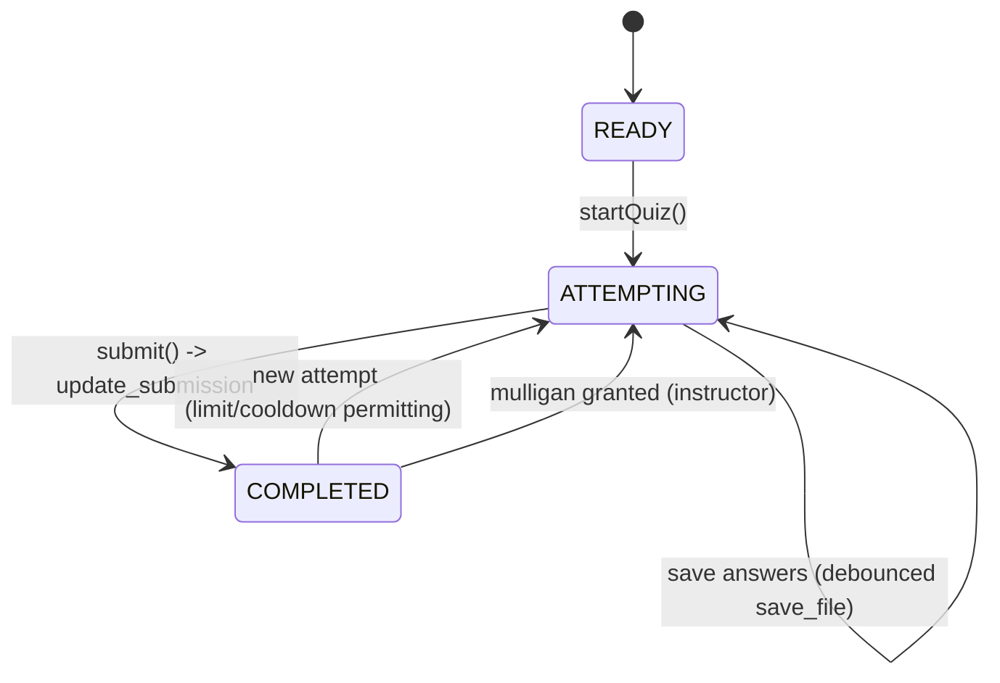

# 06 — Quiz, Reading, Textbook, Explain

These task kinds are first-class citizens of the activity sequence, not bolted-on
modes. All schemas below are verified against the legacy frontend
(`frontend/components/quizzes/`, `reader.ts`, `textbook.ts`) and remain
wire-compatible so existing course content loads unchanged (user requirement:
mirror existing quizzer types).

## 1. Quiz

### 1.1 Data layout (legacy-compatible)

| Where                     | What                                                                                                |
| ------------------------- | --------------------------------------------------------------------------------------------------- |
| `assignment.instructions` | `QuizInstructions` JSON (questions, settings, pools)                                                |
| `assignment.on_run`       | answer key / checks JSON, keyed by question id — **never sent to students**; grading is server-side |
| `submission.code`         | `QuizSubmission` JSON (student answers, attempt state, feedback)                                    |

```ts
// src/quiz/types.ts
export interface QuizInstructions {
    questions: Record<string, QuizQuestion>;
    settings: {
        attemptLimit: number; // -1 = unlimited
        coolDown: number; // -1 = none
        feedbackType: "IMMEDIATE" | "NONE" | "SUMMARY";
        questionsPerPage: number; // -1 = all on one page
        poolRandomness: "ATTEMPT" | "SEED" | "NONE" | "GROUP";
        readingId: number | null; // optional reading preamble shown above the quiz
    };
    pools: { name: string; amount: number; questions: string[]; group?: string }[];
}

export type QuizQuestion =
    | McqQuestion // 'multiple_choice_question'
    | MultipleAnswersQuestion // 'multiple_answers_question'
    | TrueFalseQuestion // 'true_false_question'
    | TextOnlyQuestion // 'text_only_question'
    | MatchingQuestion // 'matching_question'   (statements + answers dropdowns)
    | MultipleDropdownsQuestion // 'multiple_dropdowns_question' ([key] markers in body)
    | ShortAnswerQuestion // 'short_answer_question'
    | FillInMultipleBlanksQuestion // 'fill_in_multiple_blanks_question' ([key] markers)
    | CalculatedQuestion // 'calculated_question'
    | EssayQuestion // 'essay_question'
    | FileUploadQuestion // 'file_upload_question'
    | NumericalQuestion; // 'numerical_question'

export interface QuizSubmission {
    studentAnswers: Record<string, QuizAnswerValue>;
    attempt: { attempting: boolean; count: number; mulligans: number };
    feedback: Record<string, QuizFeedback>; // {correct, score, message, status}
}
```

All twelve question types ship in v2 with renderer + editor components. The
`type` field discriminates the union; an `UnknownQuestion` fallback renders the
raw body read-only so malformed content never crashes the quiz (Story 15.3 spirit).

### 1.2 Attempt lifecycle



- `startQuiz()` increments `attempt.count`, sets `attempting=true`, clears
  feedback, computes the visible question set by hiding pooled questions:
  `subsetRandomly(pool.questions, pool.amount, seed)` where seed =
  `submission.id` (SEED), `submission.id + attempt.count` (ATTEMPT), or no
  shuffle (NONE/GROUP groups share a pool draw).
- Answer edits write `QuizSubmission` JSON through the normal
  `save_file('answer.py', json)` path — identical persistence machinery as code
  tasks (one save pipeline, doc 03 §2.3).
- `submit()` posts `update_submission` (status 0, correct false, timestamps,
  passcode); the **server** regrades (`regrade_if_quiz`) using `on_run` checks
  and the response carries `feedbacks`, `submission_status`, `correct`, which
  the client merges into `QuizSubmission.feedback`. `feedbackType` controls how
  much of that is displayed (IMMEDIATE per-question, SUMMARY score only, NONE).
- Cooldown/attempt-limit verdicts are computed client-side for UX but enforced
  server-side (Epic 20).

### 1.3 Rendering details

- `fill_in_multiple_blanks` / `multiple_dropdowns`: bodies contain `[key]`
  markers (escaped via `[[ ]]`); a tokenizer splits the sanitized body and
  interleaves inputs/selects. Tokenizer is a pure function with exhaustive tests.
- `matching`: statements column + shuffled answers; per-statement dropdown.
- Question bodies are markdown → sanitized HTML; code blocks get CodeMirror
  read-only highlighting.
- `questionsPerPage` paginates within the quiz task; pagination state is local.
- Quiz editor (instructor): form-based editor per question type writing
  `instructions` + `on_run` JSON via `save_file('!instructions.md'…)` — actually
  via the instructor VFS mapping for those columns (doc 04 §4).

## 2. Reading

- Content = `assignment.instructions` markdown (saved as `!instructions.md`),
  rendered sanitized; optional embedded video (YouTube/iframe allowlist).
- **Progress tracking** (legacy-compatible): a scroll observer posts
  `log_event` with `event_type='Resource.View'`, `category='reading'`,
  `label='read'`, `message=JSON {position, progress, delay, moved}` on an
  interval while the task is focused and the tab is visible; video players emit
  `label='watch'`, `message={event: 'playing'|'pause', time, duration}`.
- "Mark as read" → `update_submission` with full score/correct, mirroring the
  legacy Reader's `markRead`. Auto-mark when `progress` exceeds a threshold is a
  membership-policy option.

## 3. Textbook

- `assignment.type === 'textbook'`: `instructions` holds a JSON tree
  (server `rehydrate_textbook`) whose nodes reference readings/assignments by id.
- v2 renders a textbook as: navigation tree (Resource panel) + the referenced
  assignment loaded as the focused task. Page changes use the same hash
  navigation as tasks (`#page=` mirrors legacy `?page=` semantics) and lazy-load
  referenced assignments via `assignments/get_ids`.
- A textbook _containing_ groups simply nests activities; the activity rail
  shows the current group's tasks while the tree shows the book.

## 4. Explain (code explanation tasks)

`explain` assignments store an `ExplainSubmission` JSON in `submission.code`:
student-selected code excerpts plus prose explanations. v2 renders the target
code read-only (CodeMirror) with annotatable regions and a prose editor per
annotation; grading is instructor-manual (`grading_status: PendingManual`).
Schema verified against legacy `explain.ts` during Slice 6 and locked with
fixtures.
