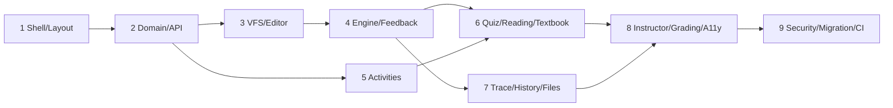

# 08 — Implementation Slices

Ordered, independently shippable slices. Each slice leaves `main` green
(lint/typecheck/tests) and demo-able. Epic numbers reference the product backlog.

## Slice 1 — Shell, stores, layout (Epics 1, 2)

- `mountBlockPy` config extension, per-mount store factories, providers,
  error boundary.
- Layout system: `SplitRegion`, `PanelHost`, presets, persistence, fullscreen,
  stacked small-screen mode.
- Panel registry with placeholder panels for every descriptor.
- **Demo:** empty workspace with draggable/collapsible panels and presets.

## Slice 2 — Domain + API client (Epics 3, 10 foundations)

- `src/api/types.ts`, mappers, `BlockPyApiClient`, `OfflineTransport`,
  TanStack Query hooks, event-log queue.
- `AssignmentSettings` parser/serializer; settings-driven `visibleWhen` wiring.
- Fixture corpus bootstrapped from a live server capture.
- **Demo:** load a real assignment+submission from blockpy-server into the shell
  (read-only display).

## Slice 3 — VFS + code task + editor adapter (Epics 4, 5)

- VFS with namespaces, bundle (de)serialization, save mapping, reset-to-start.
- `BlockEditorAdapter` over the existing `BlockPyEditor`
  (getCode/setCode/setMode/setReadOnly/setToolbox/setHighlightedLines/…);
  CodeTask panel binding `answer.py`; files Resource panel.
- Debounced save pipeline, dirty indicators, version-conflict surface.
- **Demo:** full edit/save loop against the server in block/split/text modes.

## Slice 4 — Execution engine + console + feedback (Epics 6, 7, 8)

- Pyodide worker, protocol, phases (student.run, instructor.onRun, evaluate,
  onChange), interrupt/timeout, instructor feedback shim.
- Console panel (streams, input(), queued inputs, REPL, images).
- Feedback engine + panel, traceback rewriting, `Intervention` +
  `update_submission` wiring.
- **Demo:** run a real graded BlockPy exercise end-to-end with feedback + score.

## Slice 5 — Activity sequences (Epic 1.3, 2, group loading)

- Activity model from `AssignmentGroup`, activity rail, task navigation,
  membership policy gating, per-task submissions, hash deep links,
  preset auto-switching.
- **Demo:** a homework group with multiple code tasks navigated in one UI.

## Slice 6 — Quiz + Reading + Textbook + Explain (Epics 12–15 equivalents)

- All 12 question renderers + attempt lifecycle + server-side grading round
  trip; reading renderer + progress logging + mark-as-read; textbook tree +
  page navigation; explain task.
- Quiz/reading editors for instructors (form-based).
- **Demo:** the headline integration — reading → quiz → code task → reflection
  in a single activity.

## Slice 7 — Trace, coverage, history, datasets, uploads (Epics 9, 11, 13)

- settrace instrumentation, trace scrubber, coverage gutters.
- History panel (`load_history` snapshots, diff view).
- Dataset import panel; upload/rename/download files; `save_image`.

## Slice 8 — Instructor tools, grading UX, a11y hardening (Epics 16–18, 21)

- Settings editor, sample submissions runner, tags, fork/export, group
  management; grading mode (`load_submission`, view_submissions flows).
- Accessibility audit pass; keyboard nav for Blockly evaluation.

## Slice 9 — Security review, migration validation, CI, import/export (Epics 19, 20, 22)

- Fixture-driven compatibility sweep against legacy course content; sanitizer
  audit; passcode/ip_range/exam-timer flows; export/import (`assignments/export`,
  `bulk_upload`); CI pipeline (lint, typecheck, unit, slow Pyodide suite).

## Dependency graph

