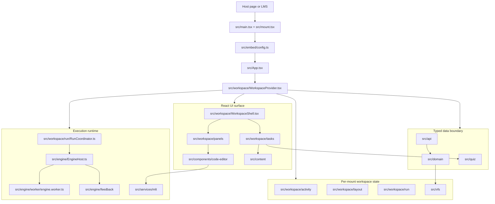
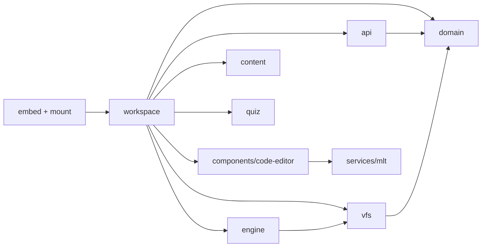
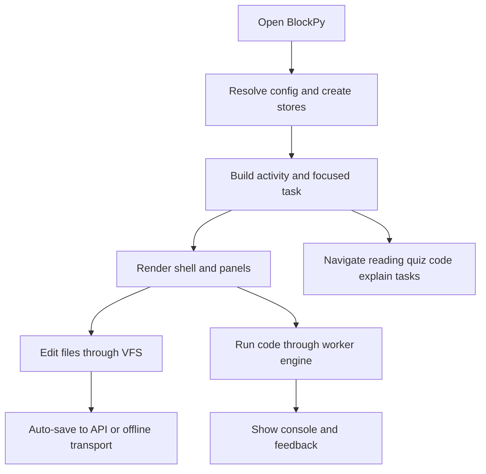

# 09 — Architecture Diagram

This document is the fastest way to orient yourself in BlockPy v2. It shows
the main runtime layers, which folders own which responsibilities, and how data
and control move through the app.

## 1. Runtime layers

## 2. Module ownership

| Area | Owns | Main files |
| ---- | ---- | ---------- |
| Mount and embedding | Browser entry points, mount API, config resolution | `src/main.tsx`, `src/mount.tsx`, `src/embed/config.ts` |
| Workspace shell | Toolbar, panel composition, layout selection, save/run controls | `src/workspace/WorkspaceShell.tsx`, `src/workspace/useWorkspace.ts` |
| Activity sequencing | Multi-task flows, gating, deep links, focused task selection | `src/workspace/activity`, `src/domain/activity.ts` |
| Panel layout | Split panes, presets, persistence, narrow-screen fallback | `src/workspace/layout` |
| Tasks | Reading, quiz, explain, textbook, code-task presentation | `src/workspace/tasks`, `src/workspace/panels/TaskPanel.tsx` |
| Files and saving | Virtual file system, dirty state, save planning, auto-save | `src/vfs`, `src/workspace/useAutoSave.ts` |
| API boundary | Typed client, endpoint helpers, offline transport, event log | `src/api` |
| Domain mapping | Assignment, submission, settings, textbook, explain parsers | `src/domain` |
| Python execution | Worker protocol, Pyodide host, runtime lifecycle, feedback shaping | `src/engine` |
| Editor surface | Blockly, CodeMirror, BlockPy editor wrapper | `src/components/code-editor`, `src/services/mlt` |
| Prose and markdown | Sanitized markdown rendering for reading/instructions | `src/content` |
| Quiz engine | Question schemas, tokenization, attempt rules, grading | `src/quiz` |

## 3. Dependency shape

The dependency direction is intentionally narrow:

Practical consequence:

- `workspace` is the composition root.
- `domain`, `quiz`, `vfs`, and most of `api` are logic-heavy but UI-agnostic.
- `engine` is isolated behind `RunCoordinator` and the worker protocol.
- `components/code-editor` remains a tool module reused by the workspace rather
  than the whole app owning the architecture.

## 4. User-visible slices mapped to code

## 5. Current gaps

These are already visible in the runtime wiring and panel registry:

- `history` and `trace` are registered panels but still placeholders.
- The Pyodide worker supports the main student/instructor run loop, but some
  deferred flows remain for later slices, such as richer trace/coverage output.
- The architecture docs are ahead of implementation in a few areas, but the
  main shell, activity, VFS, quiz, reading, explain, and execution paths are
  live in the repo.