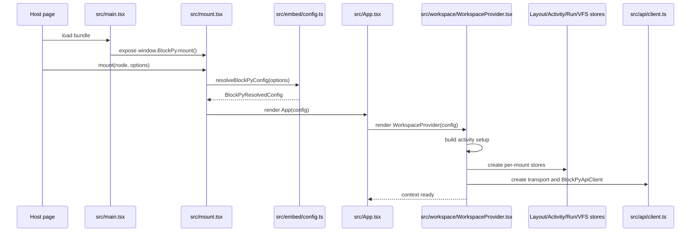
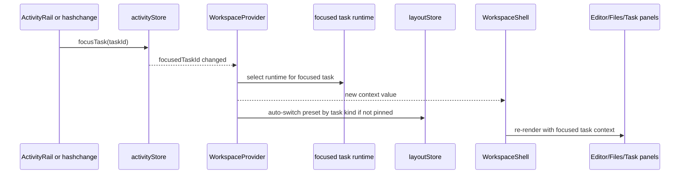
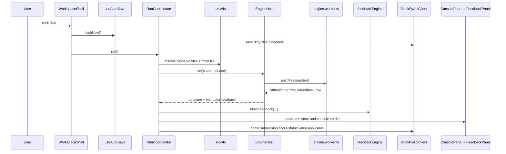
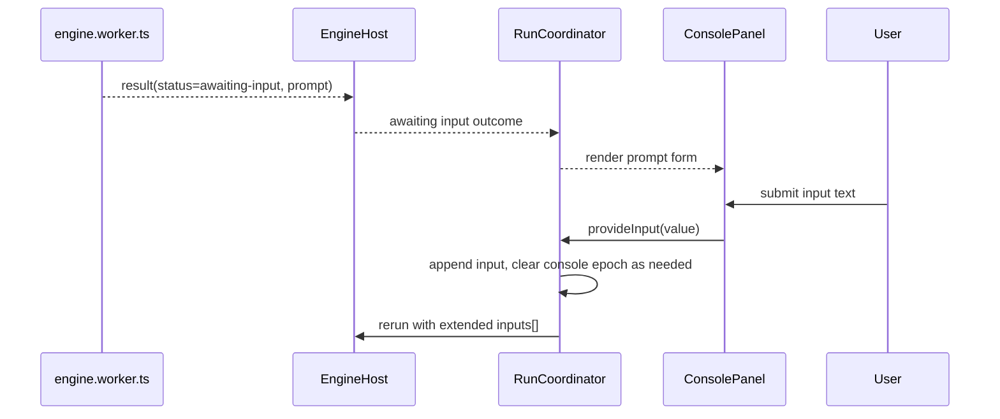
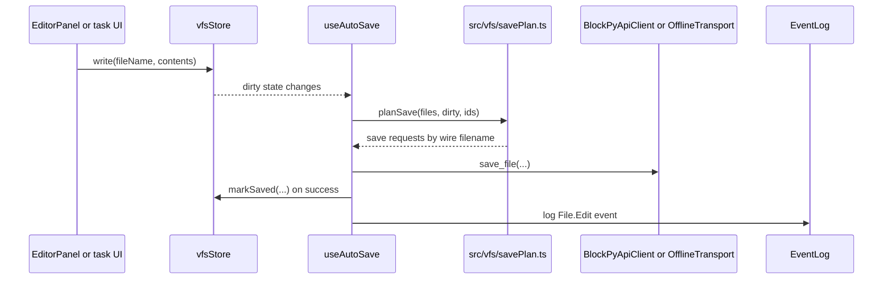

# 11 — Runtime Call Flows

This document explains the main runtime paths through BlockPy v2. It is written
for contributors who need to answer: what happens when the app mounts, when the
user changes tasks, when they run code, and when files save?

## 1. Mount and initial hydration

### 1.1 Flow summary

### 1.2 What is decided during mount

- Whether the app is online or offline.
- Whether the mount is a single assignment or a multi-task activity.
- Which task is focused first.
- Which VFS and save identifiers belong to that focused task.
- Which layout preset should be active for the focused task kind.

### 1.3 Main ownership points

- `src/main.tsx`: browser entry point and dev demo wiring.
- `src/mount.tsx`: public mount API and rerender/unmount handle.
- `src/embed/config.ts`: config normalization.
- `src/workspace/WorkspaceProvider.tsx`: the real composition root.

## 2. Task focus and layout switching

When the user moves between tasks, the workspace does not rebuild the app. It
switches the focused task runtime and lets tools follow that focus.

Key consequences:

- Each task keeps its own VFS/runtime identity.
- The shell stays mounted while the focused task changes.
- The editor and file views follow the new focused task automatically through
  context.
- Layout can adapt to task kind without destroying the app state.

## 3. Run flow: mount to engine to feedback

This is the core code-execution path.

Important details:

- The shell flushes pending saves before running.
- The worker protocol is discriminated by message kind and run id.
- Instructor `on_run` grading is a second phase layered onto the student run.
- Console output and feedback are projections of run state, not direct worker
  ownership inside the panels.

## 4. Input replay during a run

`input()` is handled by replaying the run with the accumulated answers.

This keeps runtime behavior deterministic and avoids trying to mutate a paused
Python interpreter in place.

## 5. Save flow

Saving is VFS-driven rather than editor-driven.

Important details:

- Dirty tracking is per VFS file, not per editor widget.
- Bundled extra files are reserialized as whole payloads when needed.
- Generated files are excluded from save requests.
- Offline mode follows the same client path, but the transport mutates local
  persisted state instead of hitting the network.

## 6. End-to-end mental model

If you need a compressed version of the whole app, it is this:

1. Mount config creates a workspace instance.
2. The workspace instance exposes one focused task at a time.
3. Tools operate on the focused task through the VFS and run coordinator.
4. API and offline transport share the same typed client surface.
5. The worker executes code; feedback and console are derived state rendered by
   panels.
6. Saving and grading are side effects coordinated by the workspace layer, not
   by the editor widgets themselves.

That is the shortest reliable path from mount to run to save when debugging or
adding features.
