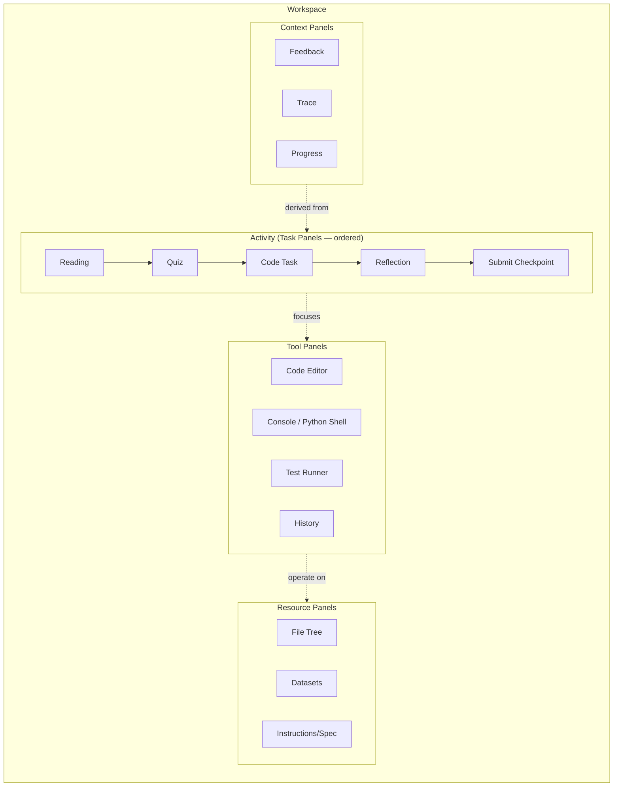

# BlockPy v2 Architecture

This directory contains the technical design for the next generation of BlockPy: a
web-based pedagogical programming environment that unifies coding exercises,
quizzes, readings, textbooks, and software-engineering activities in a single
integrated workspace, backed by the existing
[blockpy-server](https://github.com/blockpy-edu/blockpy-server) models and endpoints.

## Documents

| Doc                                                                              | Contents                                                                                      |
| -------------------------------------------------------------------------------- | --------------------------------------------------------------------------------------------- |
| [01-domain-model-and-server-api.md](01-domain-model-and-server-api.md)           | Typed domain model mirroring blockpy-server models; endpoint catalog; typed API client design |
| [02-workspace-panels-and-activities.md](02-workspace-panels-and-activities.md)   | Panel taxonomy (Task/Resource/Tool/Context); activity document model; layout system           |
| [03-state-model.md](03-state-model.md)                                           | Zustand store architecture, derived state, dirty/sync semantics                               |
| [04-virtual-file-system.md](04-virtual-file-system.md)                           | Namespaced VFS, resolution rules, file tabs, serialization                                    |
| [05-execution-engine.md](05-execution-engine.md)                                 | Pyodide worker, execution phases, feedback engine, trace/coverage, console                    |
| [06-assessment-quiz-reading-textbook.md](06-assessment-quiz-reading-textbook.md) | Quiz schema and runner, reading tracking, textbook navigation, explanation tasks              |
| [07-testing-migration-security.md](07-testing-migration-security.md)             | Test strategy, legacy payload migration, sanitization and isolation                           |
| [08-implementation-slices.md](08-implementation-slices.md)                       | Ordered delivery plan with epic/story traceability                                            |
| [09-architecture-diagram.md](09-architecture-diagram.md)                         | One-page visual map of runtime layers, module ownership, and integration paths                |
| [10-developer-onboarding-by-folder.md](10-developer-onboarding-by-folder.md)     | Folder-by-folder onboarding guide for contributors                                            |
| [11-runtime-call-flows.md](11-runtime-call-flows.md)                             | Mount, task focus, run, and save call flows across the app                                    |

## Core thesis

The single most important design decision is the separation of **what the student
is doing** from **what the student uses while doing it**:

- An **Activity** is an ordered, document-like sequence of pedagogical tasks
  (readings, quiz questions, code tasks, reflections, submissions). It maps onto
  the backend's `AssignmentGroup` → `Assignment[]` structure: every assignment in
  the group is one _task_ in the activity, and each task owns a `Submission`.
- The **Workspace** is the persistent infrastructure surrounding the activity:
  files, editor, Python runtime, console, terminal-like tools, history, and
  feedback. Workspace services persist as the student moves between tasks.

## Target stack

| Concern        | Choice                                                                                                                          | Status in repo                                                                                                      |
| -------------- | ------------------------------------------------------------------------------------------------------------------------------- | ------------------------------------------------------------------------------------------------------------------- |
| UI             | React 19 + TypeScript strict                                                                                                    | present                                                                                                             |
| Build          | Vite                                                                                                                            | present                                                                                                             |
| App state      | Zustand (slices per domain)                                                                                                     | present                                                                                                             |
| Server sync    | TanStack Query over a typed `BlockPyApiClient`                                                                                  | **to add** (justification: cache/invalidation/retry semantics for ~30 endpoints; hand-rolling reproduces it poorly) |
| Text editing   | CodeMirror 6                                                                                                                    | present                                                                                                             |
| Block editing  | Existing `BlockPyEditor` (Blockly 12 + MLT sync) behind an adapter API                                                          | present                                                                                                             |
| Python runtime | Pyodide in a dedicated Web Worker                                                                                               | partial (`pyodideRunner.ts` is main-thread; will move to worker)                                                    |
| Markdown       | `marked` (or `markdown-it`) + `DOMPurify` + highlight via CodeMirror's highlighter                                              | **to add**                                                                                                          |
| Routing        | None initially — the app is embeddable; host page / LMS controls navigation. A tiny hash-based task router inside the activity. | n/a                                                                                                                 |

## Existing code that carries forward

- [src/components/code-editor/BlockPyEditor.tsx](../../src/components/code-editor/BlockPyEditor.tsx),
  `BlocklyWorkspace`, `CodeMirrorEditor` — become the **editor tool panel**, wrapped
  by the `BlockEditorAdapter` API (Story 5.2).
- [src/services/mlt](../../src/services/mlt) — Python↔blocks translation, unchanged.
- [src/services/python/pyodideRunner.ts](../../src/services/python/pyodideRunner.ts)
  — superseded by the worker-based engine but reused for its Pyodide bootstrap logic.
- [src/embed/config.ts](../../src/embed/config.ts) — grows into the mount/config
  layer described in Story 1.1.

## Added overview docs

- [09-architecture-diagram.md](09-architecture-diagram.md) — visual system summary
  for quick orientation.
- [10-developer-onboarding-by-folder.md](10-developer-onboarding-by-folder.md) —
  practical guide to where features live and where to edit them.
- [11-runtime-call-flows.md](11-runtime-call-flows.md) — request/response and
  state-flow walkthroughs from mount to run to save.
